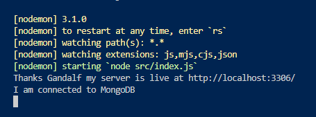
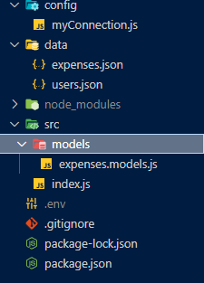
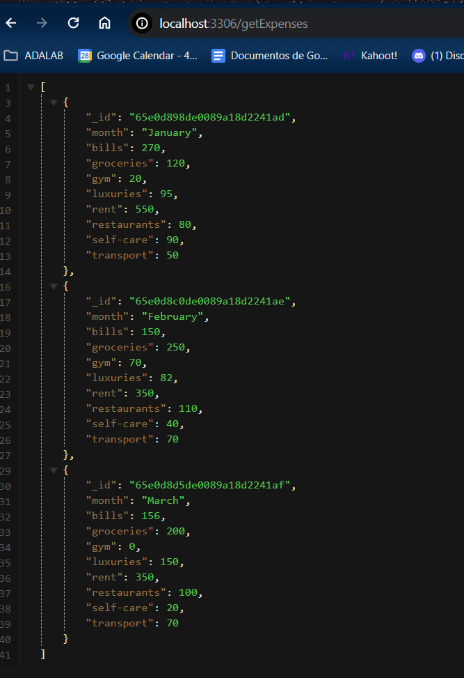
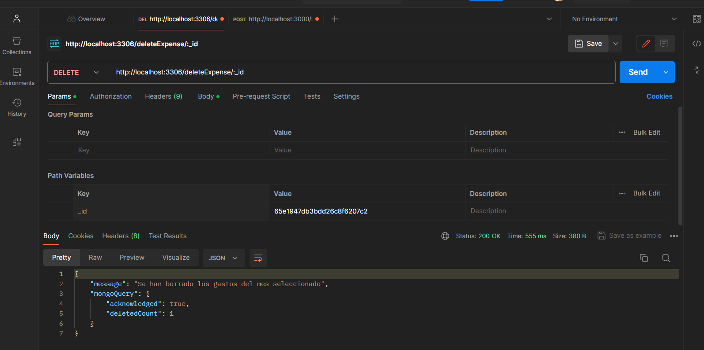
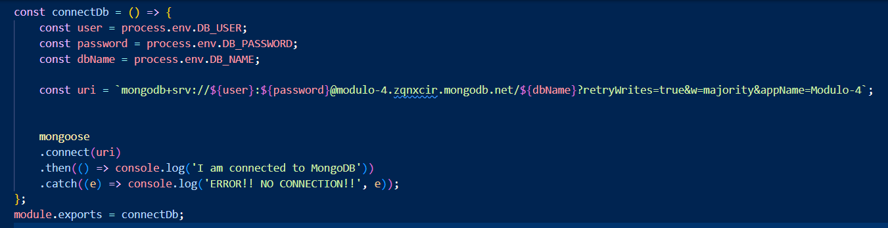
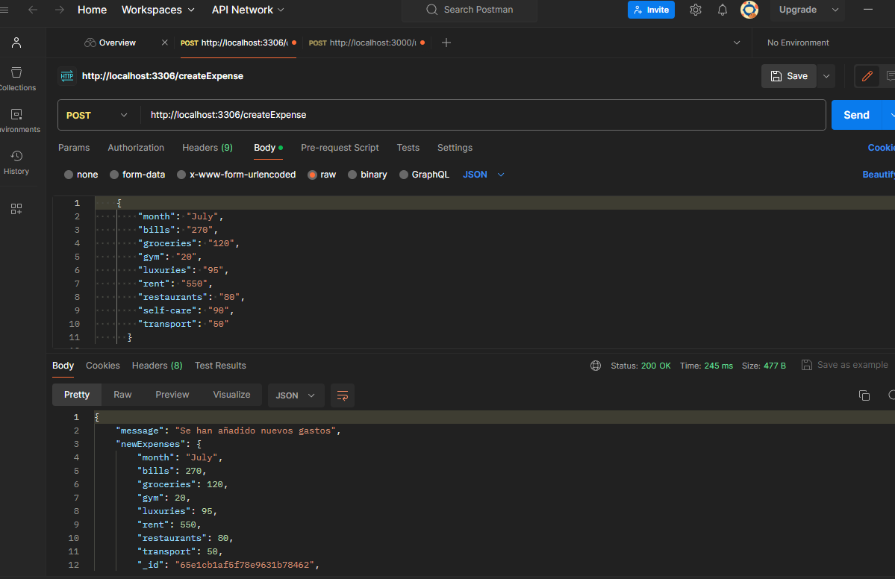
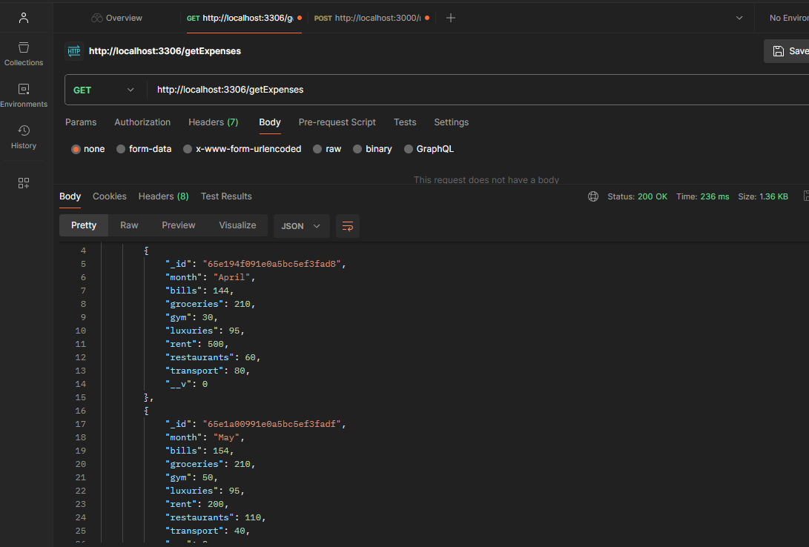

# BACKEND EXERCISE

We were asked to create an API REST, starting by building  a database, and prove that we could do CRUD actions on it:

-Find / show all existing documents

-Insert a new register

-Find a specific register / document

-Update an existing document

-Delete an existing document

I had decided to use MongoDb to build this API, and the idea is an expenses organizer to add, every month, different bills or leisure expenses.

The idea is to help people who become independant to control the money and check in which areas they spent more.

## Tech Stack

**SERVER:** Node JS, ExpressJS

**DATABASE:** Mongo DB

**CODE EDITOR:** VS CODE

**API DEVELOPMENT TESTER:** POSTMAN

**DOCUMENT LANGUAGES:** JAVASCRIPT, JSON

## Documentation

If you are trying to build this kind of project or if you have any doubts, it will be helpful to download the following software and check the official websites :

[VS CODE](https://code.visualstudio.com/)

[MONGO ATLAS](https://www.mongodb.com/es/atlas/database)

[MONGO COMPASS](https://www.mongodb.com/es/products/tools/compass)

[MONGOOSE](https://mongoosejs.com/)

[POSTMAN](https://www.postman.com/)

[NODE JS](https://nodejs.org/dist/latest-v14.x/docs/api/)

[POSTMAN](https://www.postman.com/)

YOU CAN ALSO USE A DIFFERENT SOFTWARE FOR YOUR DATABASE BUILDING:

[MYSQL](https://dev.mysql.com/)

THIS README WAS CREATED THANKS TO:

[README.SO](https://readme.so/)

## Environment Variables

To run this project, you will need to add the following environment variables to your .env file

`PORT=${yourPort}`

`DB_USER=${yourDatabaseUser}`

`DB_PASSWORD=${yourDatabasePassword}`

`DB_NAME=${yourDatabaseName}`

And then you could safely use them on your connection file.js, replacing the original information with "process.env.${yourInfo}:

## Screenshots

## Authors

- [@LauraSabrina90](https://github.com/LauraSabrina90)
- [@laura-sabrina](https://www.linkedin.com/in/laura-sabrina/)

